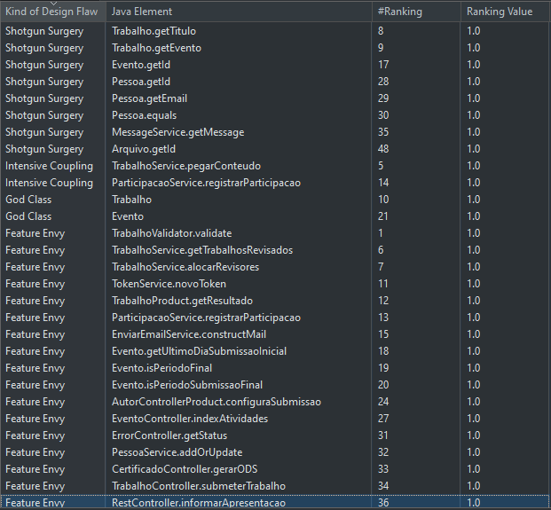
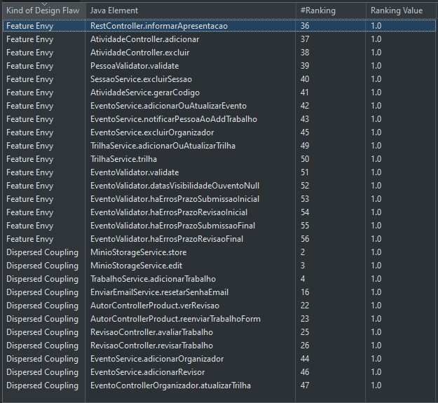

   

## Sobre o Projeto
Contest é um sistema da Universidade Federal do Ceará do campus de Quixadá, para controle de eventos, submisões de trabalhos academicos e envio de certificações.

## Objetivo do Experimento
O experimento tem como objetivo identificar os code smell do sistema Contest com JSpiRIT e a ferramenta Understand para verificação das métricas dos atributos de qualidade: Coesão, Acoplamento, Complexidade, Herança e Tamanho.

## Resultados do experimento
Para realização do experimento e identificação da evolução das métricas dos Atributos de qualidade, antes das refatorações e depois de cada refatoração dos code smells foi realizado as médições com as ferramentas JSpiRIT e Understand.

### **Medições**
<ol>
  <li>
    Medição do JSpiRIT antes das refatorações  
    

      
      
    

     
  </li>

  <li>
    Medição do JSpiRIT depois da refatorações do <strong>Feature Envy</strong>  
    

      
    

     
  </li>

  <li>
    Medição do JSpiRIT depois da refatorações do <strong>Shotgun Surgery</strong>  
    

      
    

     
  </li>

  <li>
    Medição do JSpiRIT depois da refatorações do <strong>God Class</strong>  
    

      
    

     
  </li>

  <li>
    Medição do JSpiRIT depois da refatorações do <strong>Intensive Coupling</strong>  
    

      
    

     
  </li>

  <li>
    Medição do JSpiRIT depois da refatorações do <strong>Dispersed Coupling</strong>  
    

      
    

     
  </li>
</ol>

### **Avaliação das medições**
Como resultados das refatorações, podemos observar na tabela a seguir a distribuição das refatorados. Foram restaurados no total 40 instâncias dos 58 code smells identificados, restando apenas 18 no sistema.

  

 

### **Analise dos atributos de qualidade**
Como resultado final das métricas de inferência da qualidade do software, podemos visualizar na tabela a seguir que o sistema obteve uma melhoria no atributo de Complexidade no valor **0,06%**.

  

   

## Analise mais detalhada do experimento
<a href="./docs/Relatorio Contest - Qualidade Software - Entrega final.pdf">Relatorio das refatorações</a>
